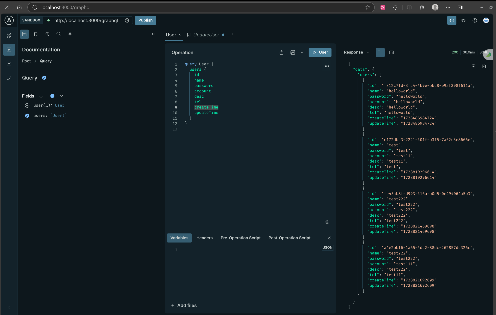
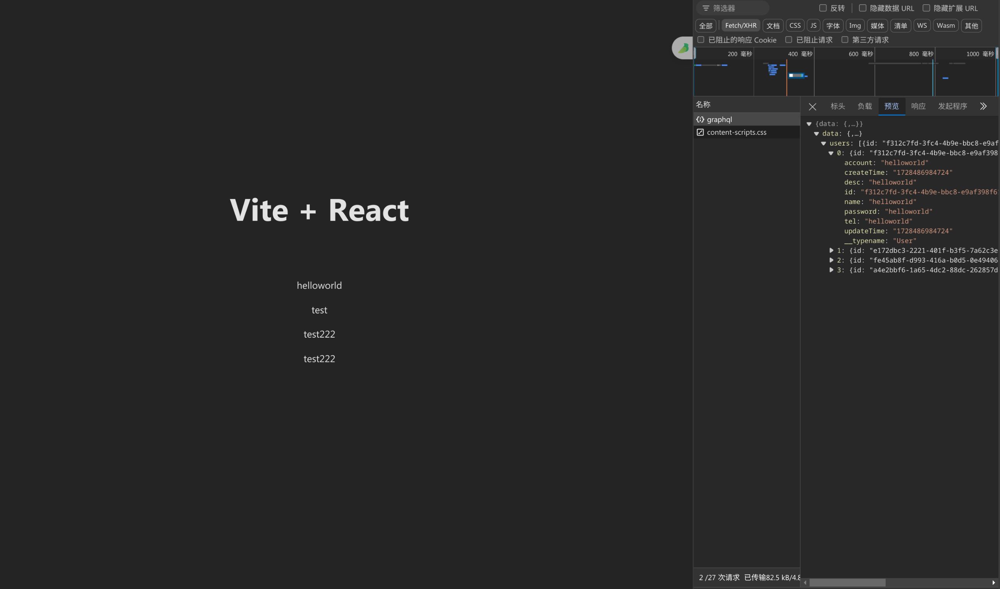
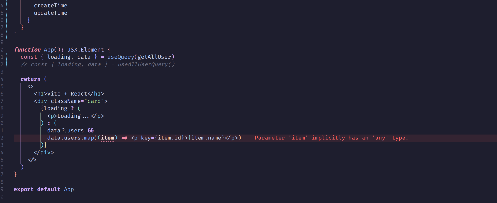
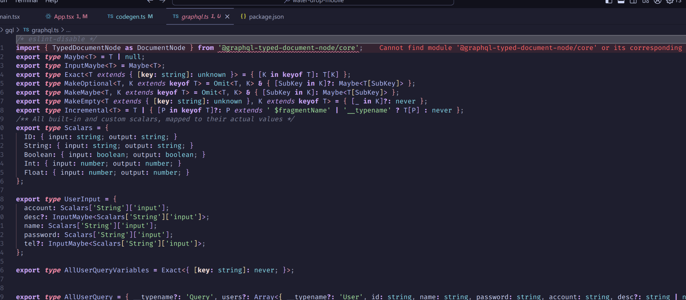
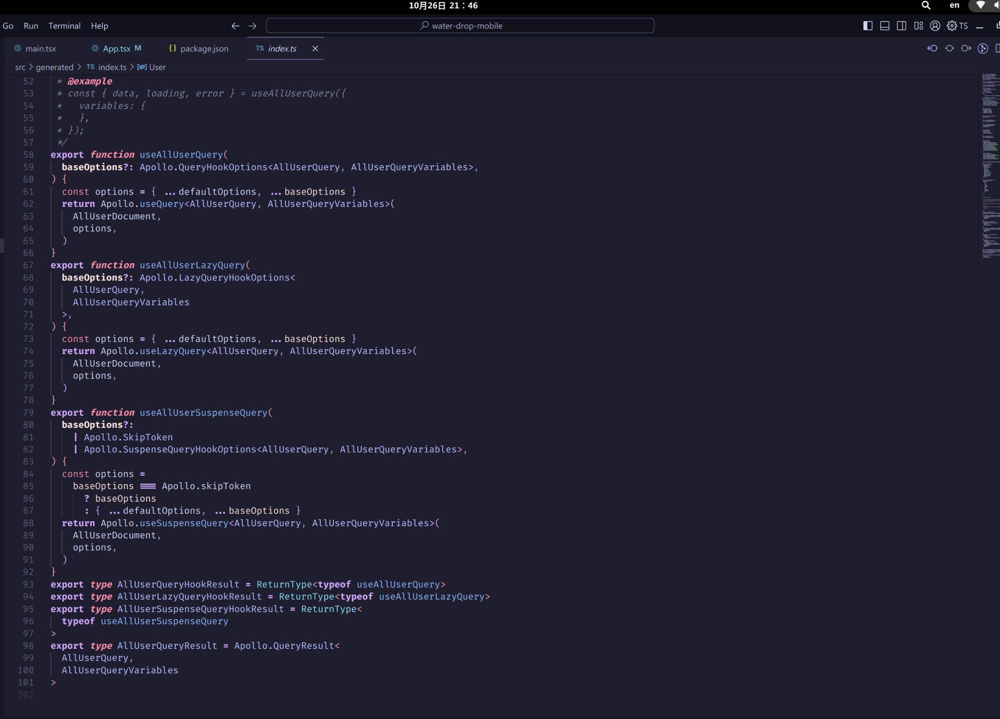
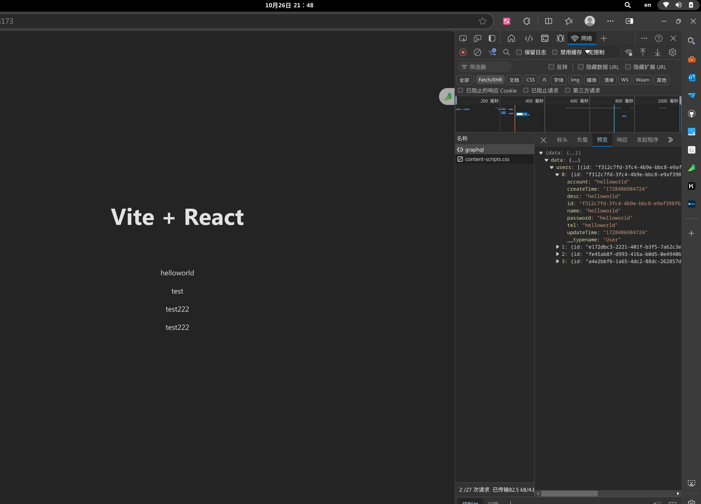
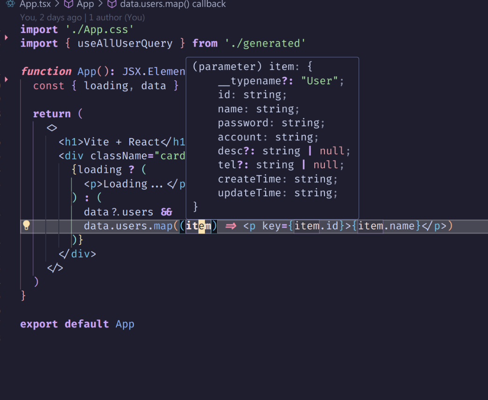

# react 使用 graphql 的最佳方式

如果我们有一个如下 graphql 服务，那么我们如何使用 react 来调用它呢？



## 1. 使用 react-apollo

如果只是想要从后端获取数据的话其实是很简单的，直接使用　 react-apollo 就可以了。

我们根据 [apollo](https://www.apollographql.com/docs/react/get-started) 的官方文档，下载　`@apollo/client`　和 `graphql` 这两个包　`pnpm add @apollo/client graphql`,创建一个　 ApolloClient 实例，然后使用　 ApolloProvider 包裹我们的应用，就可以在组件中直接使用 graphql 查询了。

```tsx
import { StrictMode } from "react";
import { createRoot } from "react-dom/client";
import App from "./App.tsx";
import "./index.css";
import { ApolloProvider } from "@apollo/client";
import { client } from "./apollo.ts";

const client = new ApolloClient({
  uri: "http://localhost:3000/graphql",
  cache: new InMemoryCache(),
});

createRoot(document.getElementById("root")!).render(
  <ApolloProvider client={client}>
    <StrictMode>
      <App />
    </StrictMode>
  </ApolloProvider>
);
```

```tsx
import { gql, useQuery } from "@apollo/client";
import "./App.css";

const getAllUser = gql`
  query AllUser {
    users {
      id
      name
      password
      account
      desc
      tel
      createTime
      updateTime
    }
  }
`;
function App(): JSX.Element {
  const { loading, data } = useQuery(getAllUser);
  return (
    <>
      <h1>Vite + React</h1>
      <div className="card">
        {loading ? (
          <p>Loading...</p>
        ) : (
          data?.users &&
          data.users.map((item) => <p key={item.id}>{item.name}</p>)
        )}
      </div>
    </>
  );
}

export default App;
```

这样我们就可以查询出来我们想要的数据了。  


但是直接这样写我们会发现从后端获取的数据是没有任何 ts 类型提示的。代码也是直接会报类型错误

那么能不能直接通过 graphql 获取到类型提示呢？　这时候就需要　`graphql-codegen` 这个包了

## graphql-codegen

`graphql-codegen` 是一个根据 graphql schema 生成类型提示的包。
首先我们需要安装 `@graphql-codegen`

```bash
pnpm add -D @graphql-codegen/cli
```

然后运行　`pnpm graphql-codegen init` 初始化 然后一路回车就行，完成后记得重新安装一下依赖　`pnpm i`

```bash
pnpm graphql-codegen init

(node:100462) [DEP0040] DeprecationWarning: The `punycode` module is deprecated. Please use a userland alternative instead.
(Use `node --trace-deprecation ...` to show where the warning was created)

    Welcome to GraphQL Code Generator!
    Answer few questions and we will setup everything for you.

? What type of application are you building? Application built with React
? Where is your schema?: (path or url) http://localhost:4000
? Where are your operations and fragments?: src/**/*.tsx
? Where to write the output: src/gql/
? Do you want to generate an introspection file? No
? How to name the config file? codegen.ts
? What script in package.json should run the codegen? codegen
Fetching latest versions of selected plugins...

    Config file generated at codegen.ts

      $ npm install

    To install the plugins.

      $ npm run codegen

    To run GraphQL Code Generator.
```

这时会生成一个 `codegen.ts` 文件，以及为我们注册一个 `codegen` 命令，内容如下：

```ts
// package.json
"codegen": "graphql-codegen --config codegen.ts"

// codegen.ts
import type { CodegenConfig } from '@graphql-codegen/cli'

const config: CodegenConfig = {
  overwrite: true,
  // graphql schema 来源　可以是后端　graphql server 的地址 也可以是本地的 schema 文件
  schema: 'http://localhost:4000',
  // document 指的就是我们之前用 apollo/client 的gql 定义的查询语句
  // 这样会遍历所有　tsx 文件 查找　gql 语句
  documents: 'src/**/*.tsx',
  // 生成的文件位置　注意一定要以/结尾否则会报错　因为生成的目标是一个目录　
  generates: {
    'src/gql/': {
      preset: 'client',
      plugins: [],
    },
  },
}

export default config
```

我们把　 schema 改为我们自己的　 graphql server `http://localhost:3000/graphql` 地址，`pnpm run codegen` 生成文件，这时我们就可以在 `src/gql/` 目录下看到生成四个文件，分别是：`graphql.ts`, `index.ts`, `gql.ts`, `fragment-masking.ts`。
其中 `graphql.ts` 文件的内容就是对应的　 schema 的　 ts 类型



## 使用 typescript-react-apollo 生成 react hook

如果我们连 useQuery useMutation 都不想写，这时我们就可以使用 `@graphql-codegen/typescript-react-apollo` 插件来生成对应的 react hook，方便我们在组件中使用。

下载插件　`pnpm add -D @graphql-codegen/typescript-react-apollo`
修改 `codegen.ts` 文件

```ts
// codegen.ts
import type { CodegenConfig } from "@graphql-codegen/cli";

const config: CodegenConfig = {
  overwrite: true, // 每次生成会覆盖原有的文件
  schema: "http://localhost:3000/graphql",
  // documents 可以指向　.graphql 文件或者　.ts/tsx 文件，　这里我们使用 .graphql文件，如果使用　.ts/tsx 我们需要使用　apollo client 提供的　gql 方法定义　query 和　mutation
  documents: "src/graphql/*.ts",
  generates: {
    "src/generated/index.ts": {
      plugins: [
        "typescript",
        "typescript-operations",
        "typescript-react-apollo",
      ],
      // 对生成的文件自动格式化
      hooks: {
        afterOneFileWrite: "prettier --write",
      },
    },
  },
};

export default config;
```

注意：如果使用　`typescript-react-apollo`　那么生成的目标文件只有一个，需要把　 generates 的目标指向一个 ts 文件，同时删除　`preset: client`　这一行否则会出现生成重复 ts 类型定义的问题

编辑　`src/graphql/user.graphql` 文件

```graphql
query AllUser {
  user {
    id
    name
    password
    account
    desc
    tel
    createTime
    updateTime
  }
}
```

我们再次运行 `pnpm codegen` 命令，可以看到生成了 `src/generated/index.ts` 文件，里面包含了我们需要的 ts 类型 和 hook



我们在 App.tsx 中使用生成的 hook

```tsx
import "./App.css";
import { useAllUserQuery } from "./generated";

function App(): JSX.Element {
  const { loading, data } = useAllUserQuery();

  return (
    <>
      <h1>Vite + React</h1>
      <div className="card">
        {loading ? (
          <p>Loading...</p>
        ) : (
          data?.users &&
          data.users.map((item) => <p key={item.id}>{item.name}</p>)
        )}
      </div>
    </>
  );
}

export default App;
```

我们可以看到是没有问题的

类型提示也是有的

